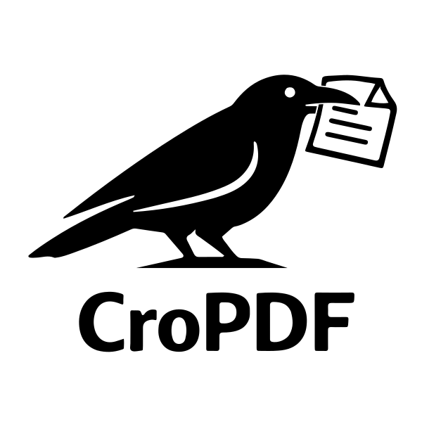

# CroPDF-MacOS

> This repository is the native macOS version of [CroPDF](https://github.com/ericceg/CroPDF), rebuilt as a SwiftUI/AppKit desktop app while keeping the same core goal: fast, lossless PDF figure cropping.

[]()
[](https://swift.org)

<p align="center">
   
</p>

**Lightweight PDF cropper that keeps vector quality.** Extract figures from textbooks for Typst, LaTeX, or any other document.

## Why I Made This

I write my math notes in [Typst](https://typst.app) and often want to include figures from textbooks (which I have as PDFs). To preserve the best possible quality (sharp text, scalable diagrams, no compression artifacts) I need to **crop the original PDF and keep it in PDF format**.

Yes, some PDF viewers can do this. But I wanted something:
- **Lightweight** — no bloated software, just a simple tool
- **Fast** — open, crop, save, done
- **Lossless** — true vector output, not a rasterized screenshot

So I built CroPDF-MacOS: a macOS-native rebuild of [CroPDF](https://github.com/ericceg/CroPDF) in Swift, using PDFKit and Quartz, focused on doing one thing well.

## Features

- 📄 **Vector-quality output** — crops PDFs without rasterization
- 🖱️ **Visual selection** — draw a rectangle to define the crop area
- ⌨️ **Pixel-perfect adjustment** — fine-tune with arrow keys
- 📖 **Page navigation** — browse multi-page PDFs easily
- 🧭 **Outline + thumbnail sidebar** — jump through long PDFs faster
- 🍎 **Native macOS app** — SwiftUI/AppKit UI with PDFKit rendering
- 🪶 **Minimal footprint** — no Python runtime or third-party app framework

## Installation


### Quick Install (recommended)

Download the latest DMG from [GitHub Releases](https://github.com/ericceg/CroPDF-MacOS/releases), open it, and move `CroPDF.app` into your `Applications` folder.

### From Source

```bash
git clone https://github.com/ericceg/CroPDF-MacOS.git
cd CroPDF-MacOS
swift build
```

You can open the package directly in Xcode and run it as a native macOS app.

### Build a DMG

```bash
make dmg
```

This creates `dist/CroPDF.dmg`.

**Note:** `Node.js` and `npm` are required for the DMG step because the build uses `create-dmg` via `npx`.

## Usage

1. Launch the app
2. Navigate to the page with the figure you want
3. **Click and drag** to draw a crop rectangle
4. Fine-tune the selection:
   - **Arrow keys** — move the rectangle (1pt)
   - **Shift + Arrow** — resize the rectangle
   - **Space + Arrow** — move/resize by 25pt
5. Click **Crop and Save** → choose output location

The output is a proper PDF — scalable, searchable, perfect for embedding.

## Keyboard Shortcuts

| Shortcut | Action |
|----------|--------|
| `⌘O` | Open PDF file |
| `⌘S` | Crop and save |
| `⌘G` | Go to page |
| `←` `→` | Navigate pages (when no selection) |
| `Arrow keys` | Move selection (1pt) |
| `Shift + Arrow` | Resize selection |
| `Space + Arrow` | Move/resize by 25pt |
| `Escape` | Deselect area |

## Use Cases

- 📚 Extract figures from textbooks for your notes
- 📝 Include diagrams in Typst/LaTeX documents
- 🎓 Crop theorems or examples for presentations
- 📊 Pull charts from papers for slides

## Requirements

- macOS 14+
- Swift 6.2+ (for building from source)

If you use the packaged app from Releases, no separate runtime is required.

## License

MIT. See [LICENSE](LICENSE).
